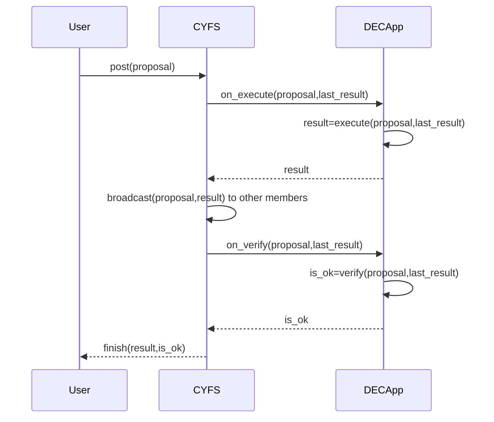
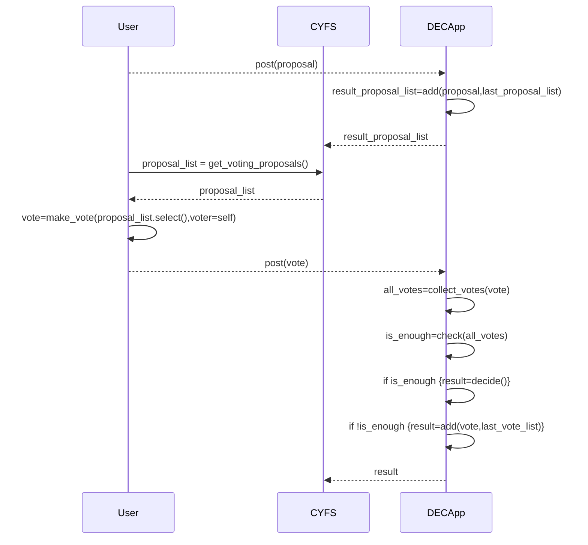

# Proposal and consensus achievement process

From the previous introduction to the scenario of `Shared Property Rights`, it is not difficult to see that the key issues is:

-   How to build a `Consortium Blockchain` simply and cheaply?

1. Simply

-   Define standard `Object`s for `CYFS` users to ensure they representing in the same way.
    -   [`Group`](https://github.com/buckyos/CYFS/issues/135#issue-1633468534)
    -   [`GroupProposal`](https://github.com/buckyos/CYFS/issues/137#issue-1635731802)
    -   [`GroupConsensusBlock`](https://github.com/buckyos/CYFS/issues/137#issue-1635731802)
    -   [Storage of BlockChain](https://github.com/buckyos/CYFS/issues/71#issuecomment-1378616109)
-   Use the `BDT` protocol to ensure the interconnection between `CYFS` users, even users under NAT, and protect privacy through protocol encryption.
-   Provide a basic consensus framework to ensure that all proposals are received, executed and verified in a unified order.The `DECApp` developers only need to define the implementation and verification methods of proposals according to their needs,it's a `Smart Contract`.

-   For the ending user,They only need to complete the operation following the guidance of `DECApp`:

    -   Initialize the `Group`.
    -   Create the `proposal`.
    -   Submit the `proposal`.
    -   Check and sign the `proposal` as a vote.
    -   The decide will be formed automatically by `DECApp`.

The follow sequence diagram will show a common flow for a proposal.

A vote on a proposal is a proposal that depends on the original proposal,and its execution process is exactly the same as the general proposal.

A proposal that requires voting, from the original proposal to the formation of the final resolution, the implementation process is as follows.

We can find that the working mode for users and developers hasn't changed substantially against `Web2`, there are only some differences in form:

-   In the `Web2` era, the database is directly updated when the proposal is executed after the user has been authenticated.
-   In `CYFS`, there is an additional verification stage before the proposal execution results take effect. Usually, each node executes it once to compare whether the respective calculation results are the same.

And, all [`cyfs://`](https://github.com/buckyos/CYFS/issues/126) protocols will support the `Group` as a `Zone`,the same interface will be provided as `People`,so,it will work in the same way for `People` zone.

2. Cheaply
   The entire process is almost completed locally by the Group members, and no additional on-chain fees are required.

# `Hotstuff`

I will introduce `Hotstuff` briefly. Please refer to the professional literature if you want to learn more about it.

## Fault tolerance

`Hotstuff` is a type of `BFT` consensus algorithm:

1. Assume that the number of malicious nodes is `f`;
2. The total number of all nodes is `N`.
3. To reach a correct consensus:
    - The total number of votes is `v`;
    - The number of votes for normal nodes is `n`, in the worst case, all malicious nodes also participated in the vote, `n > f`;
    - The number of unvoted nodes is `N - v`, `n > N - v`;

$$
\begin{cases}
\   v >= n + f; => min(v) = n + f => min(v) = min(n) + f \\
\   n > f; => min(n) = f + 1 \\
\   n > N - v; => max(N) = n + v - 1 \\
\end{cases}

=>

\begin{cases}
\   min(v) >= 2f + 1; \\
\   n + v > N; => min(n) + min(v) > N \\
\end{cases}

=> N < f + 1 + 2f + 1 = 3f + 2; \\
=> N <= 3f + 1

$$

From the above calculations, we can prevent malicious nodes accounting for up to 1/3(excluding) of the total when we collect signatures from more than 2/3(excluding) nodes.

## Consensus process

-   `PBFT`

1. `PBFT` is the first available `BFT` algorithm, and its basic process is:

    - Sort all nodes in a certain order;
    - Select one node in order as the master node, responsible for `sorting`, `executing`, `packaging`, `blocking` for all proposals;
    - The master node broadcasts the packaged block to other nodes;
    - All nodes verify the information described in the block they received, sign the vote, and broadcast the vote to all other nodes again;
    - Each node conducts 2nd signature votes when `2f+1` signatures are collected, and broadcasts the vote to all other nodes again;
    - Each node update the local result and return it to the client when `2f+1` 2nd signatures are collected;
    - The client confirms that the request is processed correctly after `2f+1` 2nd signatures are collected.

    ** Here, it is required to collect `2f+1` signatures twice, because each node must ensure that `2f+1` nodes have received votes, so that they can recover in the event of a failure. **

2. View change:

    There should be a mechanism to change the master when the master node does evil or fails, otherwise the activity of the system cannot be guaranteed.

    The current running state of all nodes is a `view`, and the process of changing the master node is `view change`:

    - A node finds that the master node is faulty, selects the next node as the new master node, and initiates a `view change` request;
    - Other nodes sign the vote if they also agree to `view change`, and attach the block vote with the highest signature height of `2f+1`; then broadcast to other nodes;
    - Same as the previous consensus process, all nodes arrive a same state on `view change` again;
    - Each node synchronizes the local chain to the highest level according to the voting information attached to the voting during the consensus process.

-   `Hotstuff`

    `Hotstuff` optimizes `PBFT` in several pionts:

    1. Pipelining: the vote for each block is also the confirmation of the next state of the previous block, and the whole process only has two broadcasts per block on average (2\*n, block broadcast and voting);

    2. Simplify the state machine: the view change process is subtly integrated into the block consensus process, and the view change process only changes the node responsible for collecting votes for the next block;
