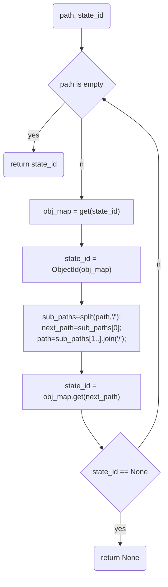
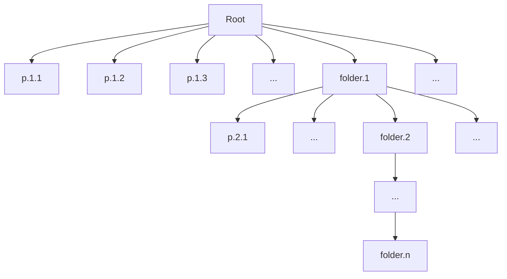

# Verify status

In the `web2` era, any information is read from a central server, you can trust any information from it as you trust the source server. It is very simple.

But in the `web3` era, for decentralization, all information comes from servers provided by someone. For single owned information, we can trust it with the signature from owner as proof of accountability. As for shared property rights information, we can only obtain information from one of the members, and these members are likely to falsify information for their interests. Therefore, we need a verification method for the shared property rights information.

As mentioned in the previous article, we use `Hotstuff` as the consensus algorithm for sharing property rights. Naturally, we also adopt the corresponding verification strategy with `2f+1` signature rate.

1. Verify with `block`

Every `block` on the chain can be verified by any node. We use the `BFT` consensus algorithm. Each valid `block` holds the voting signatures of `2f+1` nodes naturally, so all the fields contained in the `block` are recognized, the field `result_state_id` is the `ObjectId` of the state of property rights information.

2. Verify the sub-fields

-   Verify based on `ObjectId`

We known earlier that `result_state_id` is a tree structure object implemented by `ObjectMap`; `result_state_id` is obtained by computing `Hash` from all branches and leaf node values in this tree.

Therefore, all branch and leaf node values of `result_state_id` are trusted.

However, we must read the full `Desc` (immutable part) of the `Object` to verify if an `Object` is matched with the `ObjectId`, in other words: we must read all elements of `ObjectMap` and compare their `Hash` with `result_state_id` to verify that one of the elements is correct.

-   Which fields will be read to verify the sub-field with the specified path?

Now, it's clear that we must verify `ObjectMapId` of a branch in each level to verify the sub-field in a tree specified by a path. A flowchart is as follow:

We can see that we must read the full content of the first-level subdirectory contained in each level of directory to verify a child node specified by the path in the tree:

3. Performance

We stated a complete state verification scheme above, but there is a problem that we must read a large amount of redundant data for a specified field of a shared property right information. It is an impossible task in a scenario with a large data.

I think there are several solutions:

-   Design each `rpath` (representing a consensus unit in a shared property rights) carefully so that its capacity is small, and divide the large container structures into segments for management (for example: every 16 is a segment).

-   Add `2f+1` signatures to the result of each request. The server returns only the specified field(0 redundancy) for each status request, but servers owned by members of the organization must sign on the field. Of course, the burden on the service node will be increased for signatures, the more queries, the more signatures.
