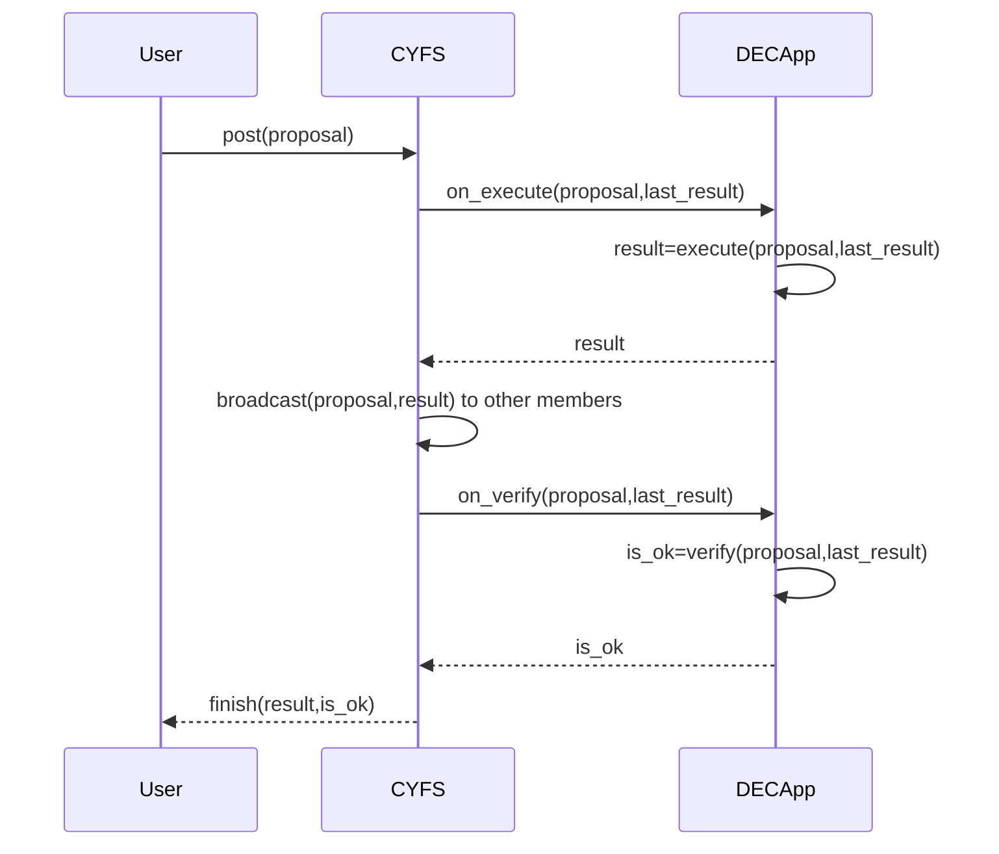
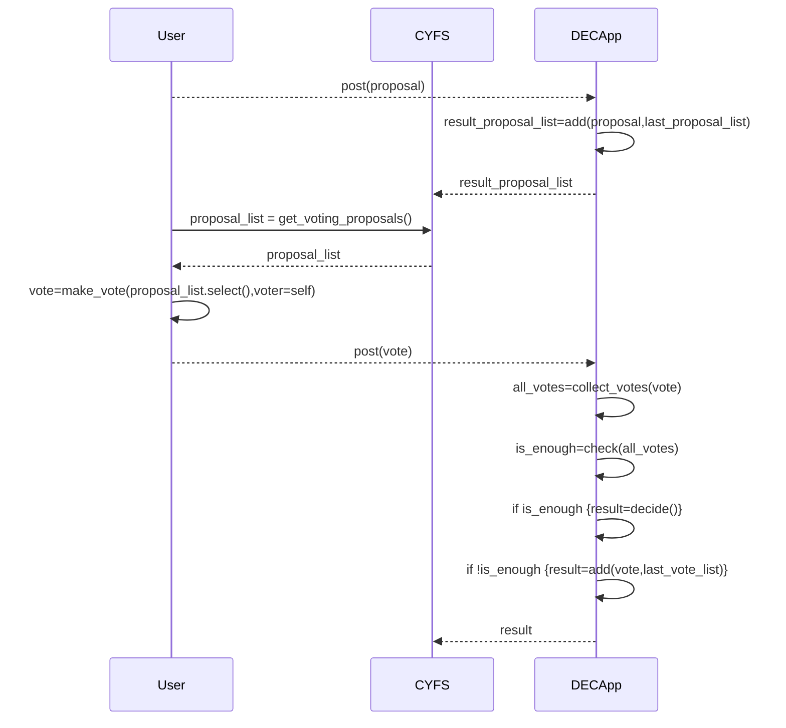

# 提案和共识方案

从前面对`共享产权`的场景介绍中，不难看出，我们面对的关键问题是：

-   如何简单廉价地搭建一个`联盟链`?

1. 简单

-   `CYFS`为此定义了一组对象，确保所有`CYFS`用户有统一的数据结构，他们之间的信息可以无损地被理解。

    -   `cyfs-base`里定义了`组织`的标准对象：Group。
    -   `cyfs-core`里定义了几个核心数据对象：GroupProposal，GroupConsensusBlock，GroupQuorumCertificate。
    -   `Group`状态存储结构在这个[issue](https://github.com/buckyos/CYFS/issues/71#issuecomment-1378616109)里有详细描述。

-   用`BDT`协议保证`CYFS`用户设备即使部署在`NAT`环境也能互联互通，同时报文级别的全加密技术也能有效地在传输层保护用户隐私。
-   提供基础地共识框架保证来自`Group`所有成员的所有的提案都被以同样的顺序接收、执行和校验。`DECApp`开发者只需要在自己的应用里按需求定义其提供方法的执行和验证代码，这跟在`ETH`上实现智能合约类似。
-   对终端用户来说，他们只需要和传统应用一样，按`DECApp`的指引完成对应的操作即可：

    -   新建组织
    -   创建提案
    -   提交提案
    -   检查其他成员发起的提案，并签字投票
    -   `DECApp`自动生成决议，更新`Group`状态

    如下时序图示意了一个提案的通用流程：

对一个提案投票是一个依赖原始提案的新提案，其执行过程和普通提案并无差异。

一个需要投票的提案，从原始提案到最终决议的业务时序图如下：

仔细阅读后，你会发现，用户和开发者的工作模式相比`Web2`并没有发生本质变化，只是形式上有些差异：

-   `Web2`时代只要验证请求用户身份，直接修改数据库执行提案。
-   `CYFS`下，除了执行提案，多了一步验证，通常情况就是每个节点执行一次，比较各自的计算结果是否都一样。

2. 廉价

如前所述，`Group`里每个提案的执行过程都在`Group`成员组成的联盟链上进行，跟`MetaChain`没有任何交互，也就省去了上链的手续费。

# `Hotstuff`

这里简单介绍一下`Hotstuff`，想要详细了解`Hotstuff`请参考专业文献。

## 容错能力

`Hotstuff`是一种`BFT`共识算法：

1. 假定环境中的恶意节点数量为`f`;
2. 环境中所有节点总数量是`N`。
3. 要达成一个正确的共识：
    - 总投票数为`v`；
    - 正常节点的投票数为`n`，最坏情况下，恶意节点也全部参与了投票，`n > f`；
    - 未投票节点数为`N - v`，`n > N - v`；

$$
\begin{cases}
\   v >= n + f; => min(v) = n + f => min(v) = min(n) + f \\
\   n > f; => min(n) = f + 1 \\
\   n > N - v; => max(N) = n + v - 1 \\
\end{cases}

=>

\begin{cases}
\   min(v) >= 2f + 1; \\
\   n + v > N; => min(n) + min(v) > N \\
\end{cases}

=> N < f + 1 + 2f + 1 = 3f + 2; \\
=> N <= 3f + 1

$$

从以上计算可以得出，基于`BFT`的共识算法，能够做到`集齐2/3以上（不含）节点签名防御1/3以内（不含）节点作恶`的健壮性。

## 共识过程

-   `PBFT`

1. `PBFT`是第一个可用的`BFT`算法，其基本过程是：

    - 按确定顺序给所有节点排序；
    - 按顺序选择节点作为主节点，负责为所有提案`排序`、`执行`、 `打包`、`出块`；
    - 主节点把打包的块广播给其他节点；
    - 所有节点收到块后，验证块中描述信息的正确性，并签名投票，再次把投票广播给其他所有节点；
    - 各节点集齐`2f+1`个签名后，进行第 2 次签名投票，并再次把投票广播给其他所有节点；
    - 各节点再次集齐`2f+1`个第 2 次签名后，更新本地结果，并返回给客户端；
    - 客户端集齐`2f+1`个第 2 次签名后，确认请求被正确处理。

    **这里要求两次收集`2f+1`次签名，是因为各节点都要确保已经有`2f+1`个节点收到了投票，便于在发生故障时能够恢复。**

2. 视图轮换：

    主节点作恶或者发生故障时，应该有机制用其他节点替换它，否则无法保证系统的活性。

    一组节点的当前运行状态就是一个`视图`，变更主节点的过程，就是`视图轮换`：

    - 有节点发现主节点故障，选择下一个节点作为新的主节点，发起`视图轮换`请求；
    - 其他节点如果也同意`视图轮换`，签名投票，并附上自己集齐`2f+1`签名高度最高的块投票；广播给其他节点；
    - 跟前面共识过程一样，达成对`视图轮换`的一致认可；
    - 在共识过程中，各节点依据投票中附加的投票信息，把本地链同步到最高高度。

-   `Hotstuff`

    `Hotstuff`对`PBFT`进行了几方面的优化：

    1. 流水线化：对每个块的投票同时也是对其上个块下一个状态的确认，整个过程平均每个块只发生两次广播（2\*n，块广播和投票）；
    2. 状态机简化：视图轮换过程被巧妙地融入块共识过程，轮换视图的过程仅仅是改变负责收集下一个块投票的节点而已；
