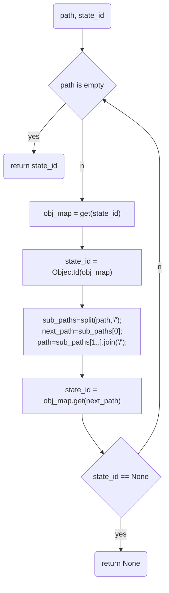
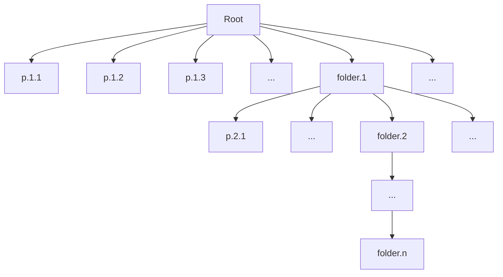

# 状态验证

在`web2`时代，任何信息都从一个中心设备上读取，只要你信任这个信息来源，就能够信任其提供的信息，这很简单。但是在`web3`时代，因为去中心化需求，所有信息都来自某个体提供的服务，对于私有产权信息，其所有者只要提供签名，我们就可以信任，毕竟我们留下了证据可以对其追责。而对于共享产权信息，我们只能从其中某位成员获得信息，而这些成员很可能因为利益关系伪造信息。因此，我们需要为读取到的共享产权信息提供一个验证方案。

在前文里讲到，我们采用`Hotstuff`作为共享产权的共识算法，很自然地，我们也要采用对应的验证策略，那就是`2f+1`签名率。

1. `block`验证

从区块链结构角度来看，链上的每个`block`都是能够被任何节点验证的。我们这里采用`BFT`共识算法，自然每个有效`block`都持有`2f+1`个节点的投票签名，所以`block`里包含的所有字段都是被认可的，这其中就包含了产权信息具体状态值`result_state_id`，这是我们最终关注的信息。

2. 子状态验证

-   基于`ObjectId`的验证方法

我们在前面提到`result_state_id`是一个由`ObjectMap`实现的树状结构对象；`result_state_id`由这个树中所有分支和叶子节点值计算`Hash`得到。

所以，基于`ObjectId`的算法，从`result_state_id`得到的所有分支和叶子节点值都是可信的。

但是，要验证一个`Object`是否是某`ObjectId`指向的真实内容，需要读取到`Object`的完整`Desc`（不可变部分），也就是说：要验证`ObjectMap`的内容是否正确，要读取到其中所有元素，再计算`Hash`。

-   验证指定路径子状态需要读取哪些数据？

到现在，验证树形结构中子状态的问题，被转换成逐级验证每个分支`ObjectMapId`。已经很清楚了：

不难看出，要验证树形结构中某路径指定子节点，我们需要读取每级目录包含的第一级子目录的完整内容：

3. 性能分析

前文给出了一个完整的状态验证方案，但从中可以看出，要读取某个共享产权信息的具体内容，需要额外读取大量的冗余数据用于验证。

在海量数据的场景下，这是不可能完成的任务。

我认为这里有几种解决方案：

-   合理设计每个`rpath`（在共享产权环境表示一个共识单元），使他容量尽可能小，对容器型结构，采用分区段管理（比如：每 16 个为一段）。
-   为每次查询的结果增加`2f+1`签名，每次状态查询，只返回对应的实际状态值(0 冗余)，但需要组织成员对这个状态签名。当然这会增加服务节点的签名负担，查询越多，签名次数越多。
