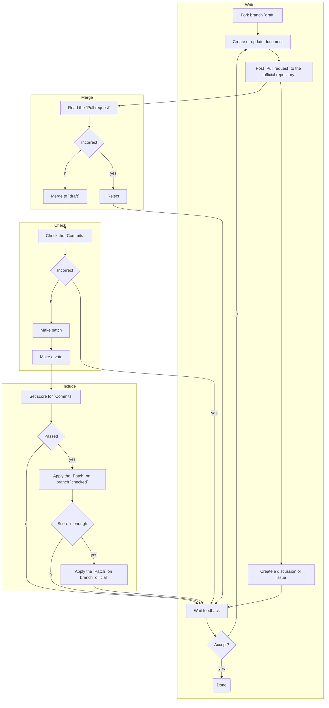
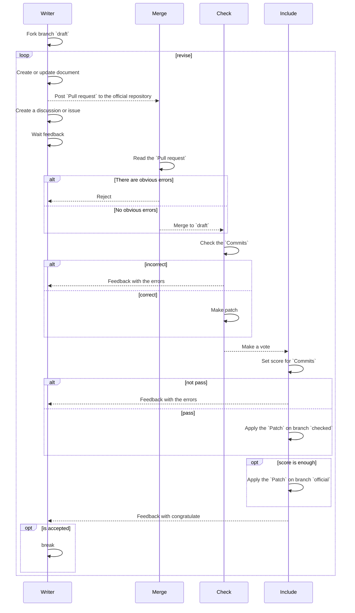

```mermaid
graph TB
    subgraph Writer
        Fork[Fork branch `draft`]-->Write[Create or update document]-->Post[Post `Pull request` to the official repository]-->Discuss[Create a discussion or issue]-->Wait[Wait feedback]-->Accept{Accept?}--yes-->Done(Done)
        Accept--no-->Write
    end

    Post-->ReadPR

    subgraph Merge
        ReadPR[Read the `Pull request`]-->ObviousError{Incorrect}--yes-->Reject[Reject]
        ObviousError--no-->MergeDraft[Merge to `draft`]
    end

    Reject-->Wait
    MergeDraft-->CheckContent

    subgraph Check
    CheckContent[Check the `Commits`]-->Incorrect{Incorrect}--yes-->Wait
    Incorrect--no-->MakePatch[Make patch]-->MakeVote[Make a vote]
    end

    subgraph Include
    MakeVote-->Score[Set score for `Commits`]-->Passed{Passed}--yes-->MergeChecked[Apply the `Patch` on branch `checked`]-->HighScore{Score is enough}--yes-->IncludeOfficial[Apply the `Patch` on branch `official`]-->Wait
    end

    HighScore--no-->Wait
    Passed--no-->Wait
```

```mermaid

%% 时序图例子,-> 直线，-->虚线，->>实线箭头

sequenceDiagram

participant Writer
participant Merge
participant Check
participant Include

Writer->>Writer: Fork branch `draft`

loop revise

Writer->>Writer: Create or update document
Writer-->>Merge: Post `Pull request` to the official repository
Writer->>Writer: Create a discussion or issue
Writer->>Writer: Wait feedback

Merge->>Merge: Read the `Pull request`

alt There are obvious errors
Merge-->>Writer: Reject
else No obvious errors
Merge-->>Check: Merge to `draft`
end

Check->>Check: Check the `Commits`

alt incorrect
Check-->>Writer: Feedback with the errors
else correct
Check->>Check: Make patch
end

Check-->>Include: Make a vote
Include->>Include: Set score for `Commits`

alt not pass
Include-->>Writer: Feedback with the errors
else pass
Include->>Include: Apply the `Patch` on branch `checked`
end

opt score is enough
Include->>Include: Apply the `Patch` on branch `official`
end

Include-->>Writer: Feedback with congratulate

opt is accepted
Writer->>Writer: break
end

end %% end loop
```
