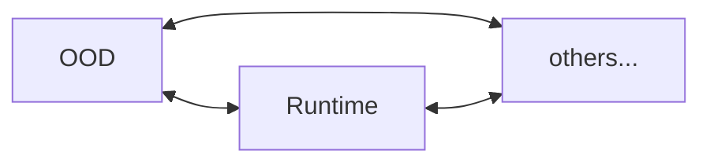
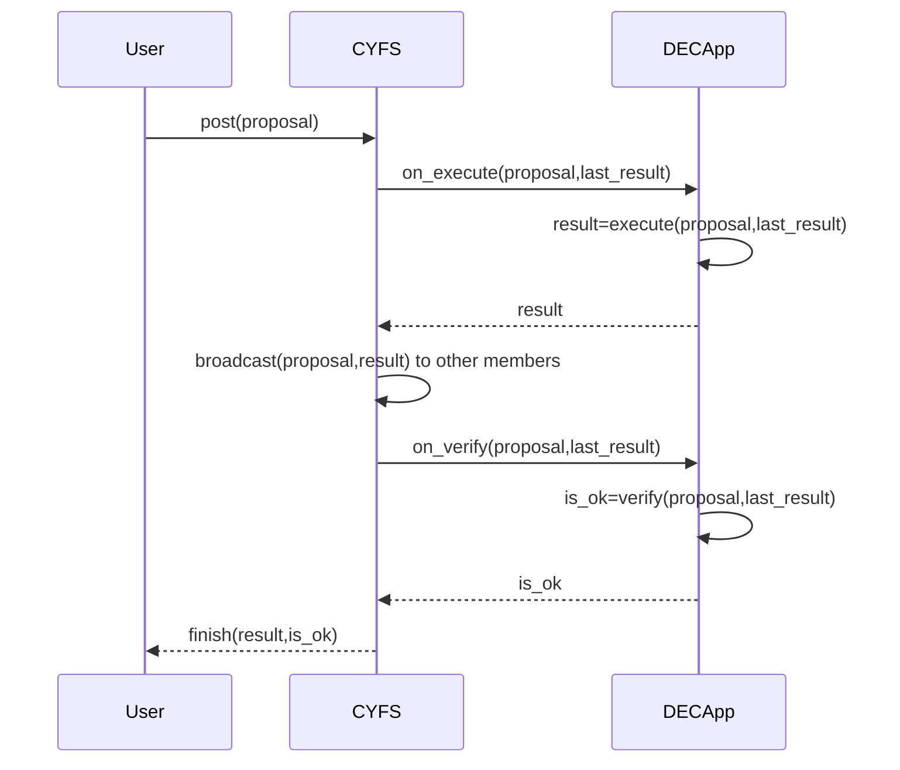
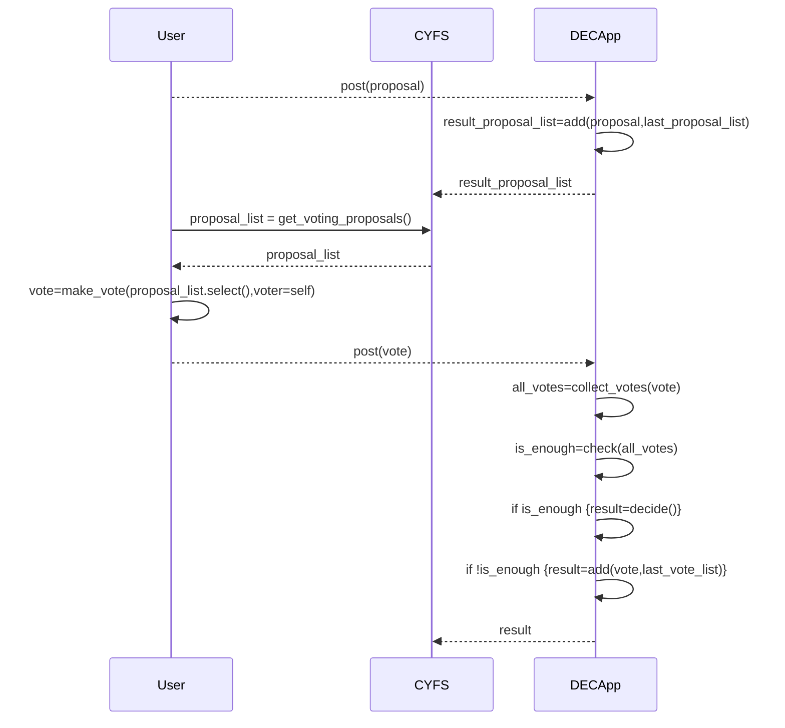

# 核心组件和功能模块

    本章先整体介绍项目源码文件分布，再逐个介绍主要的核心模块。

## 项目目录规范

`CYFS`项目根目录展开如下：

```
/--CYFS
    |--doc  // 设计文档
    |--scripts // 构建/发布相关的脚本文件
    |--src // 源代码
    |--... // 项目的各种配置文件，.gitignore, .eslintrc, package.json, .etc
```

`src`目录下的源代码模块，被分为如下几类，并分别存放在对应的子目录下：

1. 3rd

主要代码来自外部项目，做了少量的定制性修改。

2. component

基本的功能库，绝大部分模块都是这类，每个模块实现自己特异的功能。它们通常不是可执行程序，而是被其他模块依赖。如果你的模块会被其他模块依赖，可以把它归为`component`，如果只有一部分内容会被依赖，而另外一部分是私有内容（如：可执行程序中可能有实现部分公共的基础组件），可以把它拆为两部分。

3. meta

`MetaChain`依赖的相关模块，**目前只是一个概念版?我暂时了解也不多。**

4. service

`CYFS`系统中的各种服务，它们都是以独立的常驻进程形式运行在`CYFS`设备上。

5. tests

一些测试用例和示例程序，我们可以帮助补充和完善，这是一个比较好的深入了解`CYFS`的入口。

6. tools

一些用于帮助用户/开发者使用`CYFS`的小工具，我们可以设计更多有用的工具来充实它。

7. misc

其他

## `services`

我们先介绍`CYFS`系统中的各种基本服务，帮助大家对`CYFS`系统组件有个整体的了解。

1. Devices

如前面所述，`CYFS`系统中不同用户之间的通信以`Zone`为单位，每个`Zone`是由至少 1 个个人服务器`OOD`和多态终端设备(一般称为`runtime`)组成的星形网络。以下是这些设备的通信关系图：

<table border="1">
    <tr>
        <th colspan="3">Zone A</th>
        <th rowspan="5"><--></th>
        <th colspan="3">Zone Other</th>
    </tr>
    <tr>
        <td>runtime A1</td>
        <td><--></td>
        <td rowspan="4">OOD(gateway) A</td>
        <td rowspan="4">OOD(gateway) O</td>
        <td><--></td>
        <td>runtime O1</td>
    </tr>
    <tr>
        <td>runtime A2</td>
        <td><--></td>
        <td><--></td>
        <td>runtime O2</td>
    </tr>
    <tr>
        <td>runtime ...</td>
        <td><--></td>
        <td><--></td>
        <td>runtime ...</td>
    </tr>
    <tr>
        <td>runtime An</td>
        <td><--></td>
    </tr>
</table>

`Zone`内各设备是可以相互通信的



2. Services

在一个`Zone`中，有多个`service`分别以进程的形式常驻于`OOD`，它们依赖`gateway`（同样是一个服务）和其他设备交换信息。`gateway`类似于`http`协议中的`nginx`，负责转发接收到的请求到目标`service`。如下：

<table border="1">
    <tr>
        <td rowspan="4">gateway</td>
        <td><--></td>
        <td>app-manager</td>
    </tr>
    <tr>
        <td><--></td>
        <td>chunk-manager</td>
    </tr>
    <tr>
        <td><--></td>
        <td>file-manager</td>
    </tr>
    <tr>
        <td><--></td>
        <td>...</td>
    </tr>
</table>

-   app-manager: 管理用户安装/收藏的`DECApp`，提供安装、卸载、更新、启动、重启、停止、保活等功能。
-   chunk-manager：这是`CYFS`团队对`NDN`(Named Data Network)的第一次尝试性实现(完成于 2020.4)，目前和`file-manager`配合只负责`CYFS`系统`service`和`DECApp`安装包的下载。
-   file-manager: 跟`chunk-manager`一样。
-   ood-deamon: 负责`gateway`进程保活，这是唯一一个运行于`OOD`但不依赖于`gateway`的`service`。
-   ood-control: 这不是一个服务，只是`ood-deamon`和`ood-install`的具体实现模块，提供`http`接口负责完成`OOD`的激活。
-   cyfs-runtime：这是一个运行于终端设备的服务，类似于终端设备上的`gateway`，只是它背后连接的是各`DECApp`的客户端面板，当然也能被动接收来自其他设备的信息推送。

3. DECApp

从上面介绍中，很容易联想到`DECApp`，其实它和各`service`s 一样，监听经`gateway`转发来的请求并响应；不同的是，它通常有个客户端面板，负责接收用户指令，并转换成`CYFS`请求，经`runtime`转发到目标设备/`DECApp`进行处理。

## `cyfs-base`

这个模块实现了`CYFS`系统中最基础的组件，几乎所有其他组件都依赖它。

1. 基础类型

-   AccessString：用于描述权限的结构，参照`linux`文件系统的权限设计，它把访问者分成 6 种用户组：

    -   CurrentDevice：当前设备
    -   CurrentZone：当前 Zone
    -   FriendZone：我的好友 Zone
    -   OthersZone：其他 Zone
    -   OwnerDec：当前执行权限设置的`DECApp`
    -   OthersDec：非当前执行权限设置的其他`DECApp`

    这些用户组可以按需要任意组合。

    我们还可以为上述这些组配置 3 种权限：

    -   Call：可调用(post_object)
    -   Write: 可写，可更新
    -   Read：可读

    这些权限同样可以任意组合。

-   Base36：转换二进制数据成可读的大小写敏感的字符串，通常用于大小写敏感的场合，例如：

    -   浏览器地址栏
    -   `windows`文件系统

-   channel：**这个称谓多次被用到。**这里用来定义`CYFS`系统的运行环境。目前，`CYFS`系统有 3 个运行环境：

    -   nightly: 为开发者准备的集成环境，用于在开发阶段的调试。
    -   beta：为用户准备的公测环境。
    -   stable：正式的发布环境，目前还没有构建。

    这些环境之间相互隔离，它们分别接入不同的`MetaChain`和`SN/PN`服务，接入不同环境的节点之间不可互通。

-   endpoint: 对`IpAddr`的封装，用于接入物理网络。

-   BuckyError: 定义`CYFS`统一的错误描述。
-   Name: 类似于`HTTP`的域名，我们可以为任意对象在`MetaChain`上注册一个可读的昵称。
    paths: 系统内生的`RootState`路径。
-   ports: `CYFS`系统默认监听的端口(`ip`)或虚拟端口(`BDT`)。
-   protocol_fields：`CYFS`协议栈内部基于`HTTP`协议实现了`RPC`用于跨进程通信，这里扩展了`HTTP`头字段。
-   time: 定义各种标准时间戳和相关的转换函数。

2. 编解码规范

    `CYFS`中目前有三种编码格式：

    - Raw：二进制格式编码，RawEncode/RawDecode，通常用于标准化固定编码，最省空间，但不易扩展。
    - Protobuf：用`protobuf`编码，同时兼顾一定的`空间效率`和`扩展性`，用于对象编码时要注意编码的稳定性(如：Set 和 Map 应该注意各元素顺序)。
    - JSON：用`JSON`编码，空间效率较低，但可读性好。

3. 加解密

    - AES
    - Hash：目前只支持 SHA256。
    - KeyPair（PrivateKey/PublicKey）：RSA1024/2048/3072, 和 SECP256K1。
    - Signature/Verify: 签名、验证

4. 14 个标准对象

    - Action：**空，可能还没设计?**
    - AppGroup： **空，可能还没设计?**
    - Chunk：任意数据片段，但对象系统里只有片段内容的`Hash`，并不包含片段内容本身；内容存储在另外的非结构化数据系统里（NDN：Named Data Network）。
    - Device：描述设备的对象，主要包含其用于被连通的网络参数：

        - Endpoint：网络地址
        - SN
        - PN
        - Protocol_version：协议版本号，用于兼容性扩展
        - name：我们可以给它取个可读的名字

        所有这些属性都是可变的，它们被存放于`Body`中，`Device`对象由`Owner`签名后发布到`MetaChain`，用户通过`MetaChain`查询最新版本用于连通。

    - Dir：描述文件系统上的目录。它包含所有其中的文件列表及其子路径，文件（甚至是`Chunk`）列表可能有以下几种存放方式：
        - Desc：数量足够少可以存放于`Desc`，所有信息编码后小于`64KB`。
        - Body：数据量大于`64KB`，把`Body`的`Hash`置于`Desc`用于校验内容的正确性。
        - 放置在其他文件：数据量巨大，以至于单个`Dir`对象下载时间太长影响分发，新建一个文件存放`Dir`的内容，把该文件`ID`放置于`Dir`对象的`Desc`，用于校验。
    - File：描述文件系统上的文件。主要包含 3 个字段：
        - File length：不可变，`Desc`。
        - File Hash：不可变，`Desc`。
        - 包含的 Chunk 列表：可变，`Body`。按`Chunk`列表下载回来的文件，最终应该用`File Hash`校验文件内容的正确性。
    - Diff：两个文件之间的差值，多用于因为升级构建的文件。
    - Group：描述多人组织的对象，主要包含管理员列表和成员列表两个属性，它们都是可变的，我们需要通过`MetaChain`来同步更新，或者另外设计同步机制。
    - People：描述一个自然人，它只有 3 个可变属性，通过`MetaChain`进行版本同步。
        - name
        - icon
        - ood_list
    - Relation: **空，可能还没设计?**
    - Tx：就是区块链中的 Tx，用来描述一笔交易，主要包括几个字段：
        - caller：交易发起者
        - message：交易的具体参数
        - gas
    - UnionAccount：交易双方的联合账号，多用于需要多次支付的交易中。交易双方先设定好初始余额和双方持有量来创建账号，在交易进程中，双方只要在链下相互交换签名的收据确认当前账目，任何一方任何时候提交收据，都可以更新该账号余额分配比例，只要提交最新收据即可，而不必每次转账都提交上链，有效减少链上操作次数，进而减少手续费支出。它主要有 3 个字段：
        - left：交易的一方
        - right: 交易的另一方
        - service type: 交易的类型
    - Contract：描述交易双方的协议（价格、质量等）。**临时方案?**
    - ProofOfService：服务证明，描述交易最终的数量和质量，双方都应该对服务证明签字确认。如果出现纠纷，其中一方提交服务证明到`MetaChain`进行仲裁，以此保护交易双方利益，当然对于纠纷交易应该即时止损，避免其中一方不提交服务证明。**临时方案?**
    - ObjectMap：对象容器，`ObjectMap`的`ObjectId`由其容纳的所有元素计算，任何元素的变化都会导致`ObjectMap`的`ObjectId`发生改变，`RootState`就是用`ObjectMap`实现的树形结构，根`ObjectId`天然地表达了当前`RootState`状态。它有 3 种形式：
        - Map<Key, ObjectId>
        - Set<ObjectId>
        - Diff: 两个`ObjectMap`对象的差值，能方便地记录`ObjectMap`的变更历史，它可以被记录于文件，便于分发。

5. 其他结构

    - Area： `Object`的归属地。
    - NamedObject: 任意`Object`的接口`trait`。
    - TypelessObject: 任意`Object`的抽象封装，提供对象的通用字段接口，对象的实际内容被编码后以`buffer`形式保存。
    - AnyNamedObject：任意`Object`的抽象封装，能用任意`Object`构造，并且可以解码它无损还原原`Object`，通常和`TypelessObject`一起使用。
    - NDNObject：是对非结构化数据的封装（`Dir`、`File`、`Diff`）。
    - ObjectLink：**暂时不明白它的设计意图，可能是用于`Object`之间的相互引用?**
    - ObjectSigns：描述对象的签名信息，目前对于`Desc`和`Body`独立签名。**我认为这里有`Desc`和`Body`的交换风险?**
    - UniqueId：一个 16Byte 二进制串，可以用随机的`UniqueId`填充重复的`ObjectDesc`来区分不同的实体：
        - `Desc`段没有实体内容
        - 某种类型对象`Desc`重复率很高

6. `cyfs-base-derive`

    这里面实现了几个有用的宏：

    - #[derive(RawEncode)]
    - #[derive(RawDecode)]
    - #[derive(ProtobufEncode)]
    - #[derive(ProtobufDecode)]

7. `cyfs-base-meta`

    `MetaChain`的基础数据结构，**临时方案?**

## `cyfs-core`

前面提到`CYFS`把对象分成 4 类进行管理，`Core`是在`CYFS`生态发展过程中，逐渐收集的具有通用语义的对象。目前收集的多数是用于支持`CYFS`系统运行的必须对象，期待它能早日更加丰富。

1. 通用场景对象

-   Text：是一个描述字符串的通用对象，如果它足够小(<=31Bytes>)，你可以用`ObjectIdDataBuilder`构建直接保存在`ObjectId`里的对象。否则你可以使用`Text`对象，它有 3 个字段：

    -   id: 不可变
    -   header: 不可变
    -   value 可变

        **我无法从字段名看出它的设计意图，也很难说出它的规范用法?**

        你可以按需求灵活使用这 3 个字段，例如:

    -   构造可变`Text`，用`id`保存`key`，用`value`保存内容，`header`保存其他不可变属性.
    -   构造一个简短的`Text`(<=64KBytes，事实上排除`Desc`头限制会更小一点)，用`id`保存内容, 用`header`保存其他不可变属性, 用`value`保存一个可变的附加内容.
    -   构造一个较长的`Text`，用`value`保存内容，用`id`保存内容的`Hash`，以此校验`value`内容的正确性，`header`保存其他不可变属性.
    -   其他用法

-   Storage：这是一个描述二进制`buffer`的通用对象，跟`Text`一样，对于 31Bytes 以内的`buffer`可以直接置于`ObjectId`中。可变和不可变`buffer`都可以用`Storage`对象描述。
    它有 3 个字段，名字比`Text`更易理解:
    -   id: 不可变，创建时候设置
    -   hash: 不可变，`buffer`内容的`Hash`，如果要表达可变`buffer`，把`hash`置`None`以避免内容更新时`Storage`对象`ObjectId`同时发生变更.
    -   value: 可变，`buffer`的内容，描述一个不可变对象时，把`hash`字段置`value`的`hash`，用于校验`value`字段的正确性.

2. app

这些对象用来支持`app-manager`服务的运行。

-   DecApp：描述`App`的详细信息，主要字段如下：

    -   id: 不可变，**UniqueId?**
    -   source: 可变，**不了解场景?**
    -   icon: 可变，`App`图标
    -   desc: 可变，给`App`添加一段介绍性文字
    -   source_desc: 可变，**不了解场景?**
    -   tags: 可变，给`App`添加一些标签

-   AppCmd: 描述`App`的控制命令，主要有两个字段：
    -   app id: 不可变，不是`DecApp.id`，是`DecApp`的`ObjectId`，标识将要操作哪个`App`。
    -   command code: 不可变，下列枚举：
        -   Add：添加/收藏指定`App`到`App`列表
        -   Remove: 从`App`列表删除指定`App`
        -   Install: 在当前`Zone`安装指定`App`
        -   Uninstall: 从当前`Zone`卸载指定`App`
        -   Start: 启动指定`App`
        -   Stop: 停止指定`App`
        -   SetPermission: 更新指定`App`访问权限
        -   SetQuota：配置指定`App`使用资源的配额
        -   SetAutoUpdate：配置指定`App`自动更新开关
-   AppCmdList： 要顺序执行多个指令时使用
-   AppList：分类管理的`App`列表：

    -   category: 不可变，分类名称
    -   id: 不可变，由用户在当前`App`分类创建时设置。**和`category`有何差异?`category`可读可重复?这是一个`UniqueId`?**
    -   list: 可变，`App`的`ObjectId`集合，最新版本由`Zone`中的`OOD`维护。

-   AppLocalList: **不了解场景?**
-   AppLocalStatus: **不了解场景?**
-   AppManagerAction: **可能跟`app-manager`的具体实现逻辑相关?**
-   AppSetting: `App`的配置参数
-   AppStatus:

    -   id: 不可变，`DecApp`的`ObjectId`。
    -   version: 可变，版本号
    -   status: 可变，**boolean?不清楚具体意义?**

    最新版本由`Zone`中的`OOD`维护。

-   DefaultAppList: `CYFS`系统安装时自带的默认`App`列表

3. group

有一个关于`Group`模块的[`issue`](https://github.com/buckyos/CYFS/issues/71#issue-1470832184)。相关对象在`cyfs-core`实现。

把`Group`成员共同维护的信息组合称为`Group`的`状态`，我们采用区块链结构来记录状态的更新过程，采用`Hotstuff`作为共识算法。

下面逐个介绍相关的对象：

-   GroupProposal: 表达`Group`状态要更新的内容，通常它能够回答 3 个问题：

    -   谁要更新状态?
    -   要更新什么内容?
    -   如何更新?

    它主要包含如下字段：

    -   rpath: 不可变，一个`Group`共同维护的状态可能由多个`App`实现，每个`App`也可能维护多个状态，大多数场景下，这些状态由`ObjectMap`实现的树状结构保存，可以认为是`Group`版本的[`RootState`](https://github.com/buckyos/CYFS/issues/132#issuecomment-1476048950)，每个状态挂载的路径称为`rpath`。对于每个`rpath`，我们都启动一个共识链来维护它的状态同步。这里`rpath`字段表示该提案将被提交到哪个共识链。
    -   method：不可变，通常由`DECApp`定义具体支持的更新方法列表供客户端调用。
    -   params：不可变，调用方法的参数，由`DECApp`定义和解析
    -   meta_block_id：不可变，`MetaChain`当前最高块的 ID，标识该提案的提交时间在该块出现之后，常用于时间校验。
    -   effective_begining：不可变，提案何时生效。
    -   effective_ending：不可变，提案何时失效，如果该时刻到达后，该提案还没达成共识，提案应该被丢弃。
    -   payload：可变，为`DECApp`保留的一个`buffer`，用于附加一些信息，`DECApp`负责它的正确性。例如：在参数表过大，`Desc`无法容纳时，可以把它存入`payload`，而`params`字段本身存放`hash`用于校验。

-   GroupQuorumCertificate：`Group`状态达成共识的证明，按`hotstuff`规则生成。它有两种类型：

    -   QC：对前一块的确认`quorum certificate`
        -   block_id：不可变，当前`blockid`。
        -   prev_block_id：不可变，前序`blockid`。
        -   round： 不可变，前序块的投票周期。
        -   votes： 不可变，签名列表：
            -   voter： 签名者
            -   signature：签名内容
    -   TC: 对上一块出块超时的确认证书`timeout certificate`
        -   round: 不可变，超时块的投票周期
        -   votes: 不可变，对该周期超时投票列表
            -   voter: 签名者
            -   high_qc_round：该签名节点已集齐签名块的最大`round`，用于判定当前最长链
            -   signature: 签名内容

-   GroupConsensusBlock：共识链上各个块的内容。

    -   rpath: 不可变，生成该块的`rpath`。
    -   body_hash: 不可变，Hash(GroupConsensusBlock.body)，用于校验`body`的正确性。
    -   result_state_id： 不可变，该块包含的所有`GroupProposal`全部执行完后的状态。
    -   height：不可变，块高，逐块增 1，可预测；`round`因为超时的情况，前后两块`round`可能不连续，无法预测。
    -   meta_block_id：不可变，当前`MetaChain`上的最新块，表面该块出现在`MetaChain`上这个块之后。
    -   round：不可变，该块的投票周期，用于`hotstuff`。
    -   group_chunk_id：不可变，当前`Group`的版本。
    -   proposals：不可变，保存在`body`，但由`body_hash`校验保证它的正确性。保存该块打包的提案集合（也包括它们的执行结果）。
    -   qc：不可变，保存在`body`，但由`body_haash`校验保证它的正确性。保存对前序块的确认证明(quorum certificate)。
    -   tc：不可变，保存在`body`，但由`body_haash`校验保证它的正确性。上个投票周期的超时证明(timeout certificate)，如果没超时置`None`。

4. nft

`NFT`是今年比较流行的应用，`CYFS`收集并定义了它自己的`NFT`对象。理论上任何`Named Data`都是`NFT`，但多数时候`NFT`的内容都是文件。

-   NFTList：内容就是一个文件列表

5. trans

**我暂时不清楚这部分?**

6. zone

归属于相同`owner`的所有设备的管理器。

-   Zone

    -   owner: 不可变
    -   ood_list：可变，ood 列表
    -   known_device_list：可变，已知设备列表

    **如何维护`Body`的最新版本?**

## `CyfsStack`(cyfs-stack/cyfs-stack-loader/cyfs-lib)

`CyfsStack`整合了`CYFS`系统提供的所有功能模块，所有`service`或`DECApp`都通过`CyfsStack`使用`CYFS`系统。有两种集成方案：

1. 所有`service`和`DECApp`都以插件形式和`CyfsStack`集成到同一个进程。这有几个缺点：

    - 需要一个动态加载的插件系统，本身开发难度较高，开发者学习成本也很高。
    - 任何`App`的异常都可能影响整个系统的运行，这是一个灾难。
    - `App`能很容易地访问其他`App`的内存区域，安全隐患较大。

2. 每个`Service`或`DECApp`都运行在独立进程，它们通过`RPC`（Remote Procedure Call）调用`CyfsStack`。这是`CYFS`选用的方案，它很好地解决了上述问题：

    - 开发者能够自由选择他熟悉的技术开发自己的`DECApp`。
    - `DECApp`独立运行于自己的进程空间，甚至运行于独立的`docker`，它们能轻易地实现沙盒机制，隔离资源。

    当然也有几个负担：

    - 开发者需要为不同的编程语言实现一个`RPC`版本，当然，只有有人完成了这项工作并开放源代码，我们就可以直接使用。
    - `RPC`会有一定的性能损耗。

### `RPC`协议

-   通信协议采用基于`WebSocket`或`BDT`的`HTTP`协议。
-   基于`RPC`需求定义了一些通用的`HTTP`头，实现在`cyfs-base/src/base/protocol_fields.rs`。

1. `RPC`框架

`RPC`有客户端和服务端，服务端由`CyfsStac`实现，客户端由`SharedCyfsStack`实现。

<table border="1">
    <tr>
        <th>客户端</th>
        <th>服务端</th>
    </tr>
    <tr>
        <td>SharedCyfsStack</td>
        <td>CyfsStack</td>
    </tr>
    <tr>
        <td>多实例</td>
        <td>单例，每个设备运行一个实例</td>
    </tr>
    <tr>
        <td>在任意DECApp中打开，且可以同时打开多个实例</td>
        <td>由gateway(OOD)或cyfs-runtime(other devices)启动</td>
    </tr>
    <tr>
        <td>DECApp可直接调用</td>
        <td>对DECApp开发者不可见，需要通过RPC调用</td>
    </tr>
    <tr>
        <td>模块命名规范：cyfs-${function-name}-lib</td>
        <td>模块命名规范：cyfs-${function-name}</td>
    </tr>
</table>

2. 数据流程图

所有的数据都会从`DECApp`流向最终处理它们的服务，这里做了一些扩展性设计：

-   数据将会经历不定数量的转发，每次转发都会进行一定的处理或者过滤，实现它们的类型通常被定义为`${function-name}${method}${direct}Processor`。
-   流经节点可以是其他设备或者是当前设备上的任意模块。
-   每次转发过程有一个`input`来接收数据，和一个`output`来发出处理后的数据。但数据的流转的起点只有`output`，最终的处理节点只有`input`。
-   `input`通常被命名为`${function-name}${method}InputProcessor`，携带`data`的参数被命名为`${function-name}${method}InputRequest`。
-   `output`通常被命名为`${function-name}${method}OutputProcessor`，携带`data`的参数被命名为`${function-name}${method}OutputRequest`。
-   转发的过程通常被命名为`${function-name}${method}InputTransformer`或`${function-name}${method}OutputTransformer`，它们分别负责把`input`数据转换成`output`传递给下一个环节，或者反向转换。

流程图如下：

```mermaid
graph TB
    subgraph DECApp
        User-->Interface[SharedCyfsStack: function with FunctionOutputRequest]
    end

    Interface-->FindTheTarget

    subgraph SharedCyfsStack
        FindTheTarget[find target device]-->RPC.send[RPC.send]
    end

    RPC.send.->RPC.recv
    RPC.send.->OtherDevice

    subgraph CyfsStack
        RPC.recv-->ObjectHttpListener
        ObjectHttpListener-->FunctionRequestHandlerEndpoint[FunctionRequestHandlerEndpoint.call]
        FunctionRequestHandlerEndpoint-->FunctionInputProcessor[FunctionInputProcessor.call_function]
        FunctionInputProcessor-->FindNextProcessor[output_processor = get_forward]
        FindNextProcessor-->InputOfOtherModule[input_processor]
        InputOfOtherModule-->NextN[next...]
        NextN-->Ending[ending_input_processor.call_function]
    end

    FindNextProcessor.->OtherDevice

    subgraph OtherDevice.CyfsStack
        OtherDevice[Other CyfsStack in different device]
    end

    OtherDevice.CyfsStack-.eq.-CyfsStack
```

我们可以参照上述框架集成自己的功能模块到`CYFS`协议栈。你也可以参照[`issue`](https://github.com/buckyos/CYFS/issues/125)的指引，一步步地完成它，当然，如果你的整合方案过于复杂，还是要仔细研读源代码搞清全部细节。

### crates

这节简单罗列一下`CyfsStack`相关的模块。

1. cyfs-stack

它实现了`CyfsStack`和所有用于向各模块路由数据的`Processor`。`DECApp`不能直接访问，所以，`DECApp`不会直接依赖它，如果你只想开发一个`App`，可以不用关心`cyfs-stack`的任何实现。

该模块有许多命名为`${function-name}`或`${function-name}_api`的目录，它们实现的内容如下：

-   `${function-name}`：实现一些基础数据结构，可以被其他模块访问
-   `${function-name}_api`：实现功能模块的特定调用路由

2. cyfs-lib

它实现了`SharedCyfsStack`和一些协议栈默认提供的功能模块接口。`DECApp`调用协议栈通常以此为入口，因此大多数`DECApp`将会依赖这个包，`DECApp`开发者应该特别关注该模块。

如果你在为`CYFS`扩展新功能，建议你新建一个名为`cyfs-${function-name}-lib`的模块，并接收一个`SharedCyfsStack`引用作为参数来初始化该模块。而不是直接在`cyfs-lib`里添加内容，以此来解除耦合。

3. cyfs-stack-loader

初始化协议栈需要太多参数，很容易疏漏。如果你在工作中需要自己初始化它，建议你使用`cyfs-stack-loader`来进行。例如：

-   调试你的`CYFS`扩展模块
-   制作一个类似`zone-simulator`的工具

但是如果你只是开发一个`DECApp`，你只需要打开`SharedCyfsStack`，它将自动连接到由`cyfs-runtime`或`gateway`初始化的`CyfsStack`。

## Group

现实中，有许多由多人构成的组织，例如：家庭、公司、兴趣小组等。它们都是因为社会关系、相同的目标或兴趣等聚在一起，他们有共同利益，也有个人权益和偏好，所以，他们经常要对各种事项做决定。

这种组织的 IT 需求在`Web2`时代已经有很多的解决方案：

-   企业信息系统
-   `Github`社区
-   微信群
-   其他

在`Web3`时代，我们需要去中心化方案，以使用户获得更多的信息自主权和更确定的权益。`区块链`给了我们很多启发，我们可以在`联盟链`上重构这些应用。

因此，我们的问题是：

-   如何简单廉价地搭建一个`联盟链`?

### `CYFS`的解决方案

1. 简单

-   `CYFS`为此定义了一组对象，确保所有`CYFS`用户有统一的数据结构，他们之间的信息可以无损地被理解。

    -   `cyfs-base`里定义了`组织`的标准对象：Group。
    -   `cyfs-core`里定义了几个核心数据对象：GroupProposal，GroupConsensusBlock，GroupQuorumCertificate。
    -   `Group`状态存储结构在这个[issue](https://github.com/buckyos/CYFS/issues/71#issuecomment-1378616109)里有详细描述。

-   用`BDT`协议保证`CYFS`用户设备即使部署在`NAT`环境也能互联互通，同时报文级别的全加密技术也能有效地在传输层保护用户隐私。
-   提供基础地共识框架保证来自`Group`所有成员的所有的提案都被以同样的顺序接收、执行和校验。`DECApp`开发者只需要在自己的应用里按需求定义其提供方法的执行和验证代码，这跟在`ETH`上实现智能合约类似。
-   对终端用户来说，他们只需要和传统应用一样，按`DECApp`的指引完成对应的操作即可：

    -   新建组织
    -   创建提案
    -   提交提案
    -   检查其他成员发起的提案，并签字投票
    -   `DECApp`自动生成决议，更新`Group`状态

    如下时序图示意了一个提案的通用流程：



对一个提案投票是一个依赖原始提案的新提案，其执行过程和普通提案并无差异。

一个需要投票的提案，从原始提案到最终决议的业务时序图如下：



仔细阅读后，你会发现，用户和开发者的工作模式相比`Web2`并没有发生本质变化，只是形式上有些差异：

-   `Web2`时代只要验证请求用户身份，直接修改数据库执行提案。
-   `CYFS`下，除了执行提案，多了一步验证，通常情况就是每个节点执行一次，比较各自的计算结果是否都一样。

2. 廉价

如前所述，`Group`里每个提案的执行过程都在`Group`成员组成的联盟链上进行，跟`MetaChain`没有任何交互，也就省去了上链的手续费。
