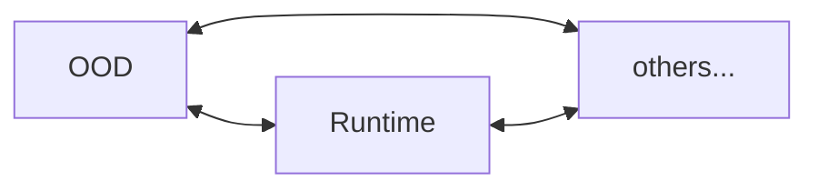

# 核心组件和功能模块

    本章先整体介绍项目源码文件分布，再逐个介绍主要的核心模块。

## 项目目录规范

`CYFS`项目根目录展开如下：

```
/--CYFS
    |--doc  // 设计文档
    |--scripts // 构建/发布相关的脚本文件
    |--src // 源代码
    |--... // 项目的各种配置文件，.gitignore, .eslintrc, package.json, .etc
```

`src`目录下的源代码模块，被分为如下几类，并分别存放在对应的子目录下：

1. 3rd

主要代码来自外部项目，做了少量的定制性修改。

2. component

基本的功能库，绝大部分模块都是这类，每个模块实现自己特异的功能。它们通常不是可执行程序，而是被其他模块依赖。如果你的模块会被其他模块依赖，可以把它归为`component`，如果只有一部分内容会被依赖，而另外一部分是私有内容（如：可执行程序中可能有实现部分公共的基础组件），可以把它拆为两部分。

3. meta

`MetaChain`依赖的相关模块，**目前只是一个概念版？我暂时了解也不多。**

4. service

`CYFS`系统中的各种服务，它们都是以独立的常驻进程形式运行在`CYFS`设备上。

5. tests

一些测试用例和示例程序，我们可以帮助补充和完善，这是一个比较好的深入了解`CYFS`的入口。

6. tools

一些用于帮助用户/开发者使用`CYFS`的小工具，我们可以设计更多有用的工具来充实它。

7. misc

其他

## `services`

我们先介绍`CYFS`系统中的各种基本服务，帮助大家对`CYFS`系统组件有个整体的了解。

1. Devices

如前面所述，`CYFS`系统中不同用户之间的通信以`Zone`为单位，每个`Zone`是由至少 1 个个人服务器`OOD`和多态终端设备(一般称为`runtime`)组成的星形网络。以下是这些设备的通信关系图：

<table border="1">
    <tr>
        <th colspan="3">Zone A</th>
        <th rowspan="5"><--></th>
        <th colspan="3">Zone Other</th>
    </tr>
    <tr>
        <td>runtime A1</td>
        <td><--></td>
        <td rowspan="4">OOD(gateway) A</td>
        <td rowspan="4">OOD(gateway) O</td>
        <td><--></td>
        <td>runtime O1</td>
    </tr>
    <tr>
        <td>runtime A2</td>
        <td><--></td>
        <td><--></td>
        <td>runtime O2</td>
    </tr>
    <tr>
        <td>runtime ...</td>
        <td><--></td>
        <td><--></td>
        <td>runtime ...</td>
    </tr>
    <tr>
        <td>runtime An</td>
        <td><--></td>
    </tr>
</table>

`Zone`内各设备是可以相互通信的



2. Services

在一个`Zone`中，有多个`service`分别以进程的形式常驻于`OOD`，它们依赖`gateway`（同样是一个服务）和其他设备交换信息。`gateway`类似于`http`协议中的`nginx`，负责转发接收到的请求到目标`service`。如下：

<table border="1">
    <tr>
        <td rowspan="4">gateway</td>
        <td><--></td>
        <td>app-manager</td>
    </tr>
    <tr>
        <td><--></td>
        <td>chunk-manager</td>
    </tr>
    <tr>
        <td><--></td>
        <td>file-manager</td>
    </tr>
    <tr>
        <td><--></td>
        <td>...</td>
    </tr>
</table>

-   app-manager: 管理用户安装/收藏的`DECApp`，提供安装、卸载、更新、启动、重启、停止、保活等功能。
-   chunk-manager：这是`CYFS`团队对`NDN`(Named Data Network)的第一次尝试性实现(完成于 2020.4)，目前和`file-manager`配合只负责`CYFS`系统`service`和`DECApp`安装包的下载。
-   file-manager: 跟`chunk-manager`一样。
-   ood-deamon: 负责`gateway`进程保活，这是唯一一个运行于`OOD`但不依赖于`gateway`的`service`。
-   ood-control: 这不是一个服务，只是`ood-deamon`和`ood-install`的具体实现模块，提供`http`接口负责完成`OOD`的激活。
-   cyfs-runtime：这是一个运行于终端设备的服务，类似于终端设备上的`gateway`，只是它背后连接的是各`DECApp`的客户端面板，当然也能被动接收来自其他设备的信息推送。

3. DECApp

从上面介绍中，很容易联想到`DECApp`，其实它和各`service`s 一样，监听经`gateway`转发来的请求并响应；不同的是，它通常有个客户端面板，负责接收用户指令，并转换成`CYFS`请求，经`runtime`转发到目标设备/`DECApp`进行处理。

## `cyfs-base`

这个模块实现了`CYFS`系统中最基础的组件，几乎所有其他组件都依赖它。

1. 基础类型

-   AccessString：用于描述权限的结构，参照`linux`文件系统的权限设计，它把访问者分成 6 种用户组：

    -   CurrentDevice：当前设备
    -   CurrentZone：当前 Zone
    -   FriendZone：我的好友 Zone
    -   OthersZone：其他 Zone
    -   OwnerDec：当前执行权限设置的`DECApp`
    -   OthersDec：非当前执行权限设置的其他`DECApp`

    这些用户组可以按需要任意组合。

    我们还可以为上述这些组配置 3 种权限：

    -   Call：可调用(post_object)
    -   Write: 可写，可更新
    -   Read：可读

    这些权限同样可以任意组合。

-   Base36：转换二进制数据成可读的大小写敏感的字符串，通常用于大小写敏感的场合，例如：

    -   浏览器地址栏
    -   `windows`文件系统

-   channel：**这个称谓多次被用到。**这里用来定义`CYFS`系统的运行环境。目前，`CYFS`系统有 3 个运行环境：

    -   nightly: 为开发者准备的集成环境，用于在开发阶段的调试。
    -   beta：为用户准备的公测环境。
    -   stable：正式的发布环境，目前还没有构建。

    这些环境之间相互隔离，它们分别接入不同的`MetaChain`和`SN/PN`服务，接入不同环境的节点之间不可互通。

-   endpoint: 对`IpAddr`的封装，用于接入物理网络。

-   BuckyError: 定义`CYFS`统一的错误描述。
-   Name: 类似于`HTTP`的域名，我们可以为任意对象在`MetaChain`上注册一个可读的昵称。
    paths: 系统内生的`RootState`路径。
-   ports: `CYFS`系统默认监听的端口(`ip`)或虚拟端口(`BDT`)。
-   protocol_fields：`CYFS`协议栈内部基于`HTTP`协议实现了`RPC`用于跨进程通信，这里扩展了`HTTP`头字段。
-   time: 定义各种标准时间戳和相关的转换函数。

2. 编解码规范

    `CYFS`中目前有三种编码格式：

    - Raw：二进制格式编码，RawEncode/RawDecode，通常用于标准化固定编码，最省空间，但不易扩展。
    - Protobuf：用`protobuf`编码，同时兼顾一定的`空间效率`和`扩展性`，用于对象编码时要注意编码的稳定性(如：Set 和 Map 应该注意各元素顺序)。
    - JSON：用`JSON`编码，空间效率较低，但可读性好。

3. 加解密

    - AES
    - Hash：目前只支持 SHA256。
    - KeyPair（PrivateKey/PublicKey）：RSA1024/2048/3072, 和 SECP256K1。
    - Signature/Verify: 签名、验证

4. 14 个标准对象

    - Action：**空，可能还没设计？**
    - AppGroup： **空，可能还没设计？**
    - Chunk：任意数据片段，但对象系统里只有片段内容的`Hash`，并不包含片段内容本身；内容存储在另外的非结构化数据系统里（NDN：Named Data Network）。
    - Device：描述设备的对象，主要包含其用于被连通的网络参数：

        - Endpoint：网络地址
        - SN
        - PN
        - Protocol_version：协议版本号，用于兼容性扩展
        - name：我们可以给它取个可读的名字

        所有这些属性都是可变的，它们被存放于`Body`中，`Device`对象由`Owner`签名后发布到`MetaChain`，用户通过`MetaChain`查询最新版本用于连通。

    - Dir：描述文件系统上的目录。它包含所有其中的文件列表及其子路径，文件（甚至是`Chunk`）列表可能有以下几种存放方式：
        - Desc：数量足够少可以存放于`Desc`，所有信息编码后小于`64KB`。
        - Body：数据量大于`64KB`，把`Body`的`Hash`置于`Desc`用于校验内容的正确性。
        - 放置在其他文件：数据量巨大，以至于单个`Dir`对象下载时间太长影响分发，新建一个文件存放`Dir`的内容，把该文件`ID`放置于`Dir`对象的`Desc`，用于校验。
    - File：描述文件系统上的文件。主要包含 3 个字段：
        - File length：不可变，`Desc`。
        - File Hash：不可变，`Desc`。
        - 包含的 Chunk 列表：可变，`Body`。按`Chunk`列表下载回来的文件，最终应该用`File Hash`校验文件内容的正确性。
    - Diff：两个文件之间的差值，多用于因为升级构建的文件。
    - Group：描述多人组织的对象，主要包含管理员列表和成员列表两个属性，它们都是可变的，我们需要通过`MetaChain`来同步更新，或者另外设计同步机制。
    - People：描述一个自然人，它只有 3 个可变属性，通过`MetaChain`进行版本同步。
        - name
        - icon
        - ood_list
    - Relation: **空，可能还没设计？**
    - Tx：就是区块链中的 Tx，用来描述一笔交易，主要包括几个字段：
        - caller：交易发起者
        - message：交易的具体参数
        - gas
    - UnionAccount：交易双方的联合账号，多用于需要多次支付的交易中。交易双方先设定好初始余额和双方持有量来创建账号，在交易进程中，双方只要在链下相互交换签名的收据确认当前账目，任何一方任何时候提交收据，都可以更新该账号余额分配比例，只要提交最新收据即可，而不必每次转账都提交上链，有效减少链上操作次数，进而减少手续费支出。它主要有 3 个字段：
        - left：交易的一方
        - right: 交易的另一方
        - service type: 交易的类型
    - Contract：描述交易双方的协议（价格、质量等）。**临时方案？**
    - ProofOfService：服务证明，描述交易最终的数量和质量，双方都应该对服务证明签字确认。如果出现纠纷，其中一方提交服务证明到`MetaChain`进行仲裁，以此保护交易双方利益，当然对于纠纷交易应该即时止损，避免其中一方不提交服务证明。**临时方案？**
    - ObjectMap：对象容器，`ObjectMap`的`ObjectId`由其容纳的所有元素计算，任何元素的变化都会导致`ObjectMap`的`ObjectId`发生改变，`RootState`就是用`ObjectMap`实现的树形结构，根`ObjectId`天然地表达了当前`RootState`状态。它有 3 种形式：
        - Map<Key, ObjectId>
        - Set<ObjectId>
        - Diff: 两个`ObjectMap`对象的差值，能方便地记录`ObjectMap`的变更历史，它可以被记录于文件，便于分发。

5. 其他结构

    - Area： `Object`的归属地。
    - NamedObject: 任意`Object`的接口`trait`。
    - TypelessObject: 任意`Object`的抽象封装，提供对象的通用字段接口，对象的实际内容被编码后以`buffer`形式保存。
    - AnyNamedObject：任意`Object`的抽象封装，能用任意`Object`构造，并且可以解码它无损还原原`Object`，通常和`TypelessObject`一起使用。
    - NDNObject：是对非结构化数据的封装（`Dir`、`File`、`Diff`）。
    - ObjectLink：**暂时不明白它的设计意图，可能是用于`Object`之间的相互引用？**
    - ObjectSigns：描述对象的签名信息，目前对于`Desc`和`Body`独立签名。**我认为这里有`Desc`和`Body`的交换风险？**
    - UniqueId：一个 16Byte 二进制串，可以用随机的`UniqueId`填充重复的`ObjectDesc`来区分不同的实体：
        - `Desc`段没有实体内容
        - 某种类型对象`Desc`重复率很高

6. `cyfs-base-derive`

    这里面实现了几个有用的宏：

    - #[derive(RawEncode)]
    - #[derive(RawDecode)]
    - #[derive(ProtobufEncode)]
    - #[derive(ProtobufDecode)]

7. `cyfs-base-meta`

    `MetaChain`的基础数据结构，**临时方案？**
